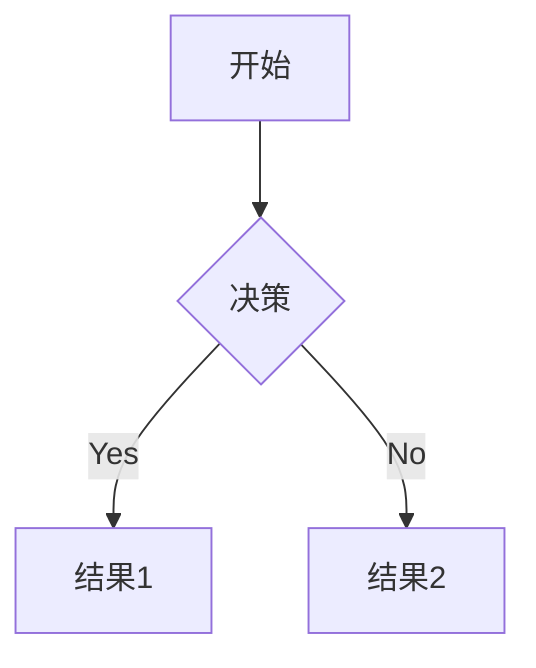

# Resound - Hugo Theme

> **Make Your Content Resound** - 让你的内容产生回响

> [!WARNING]
> 注意：这个主题还在密集开发中，请谨慎使用！欢迎提出建议和反馈。

[English Version](README_en.md)

一个优雅、功能丰富的 Hugo 博客主题，支持幻灯片、归档、搜索等多种功能。

[](https://gohugo.io/)
[](LICENSE)
[](https://hugo-theme-resound.netlify.app/)

## 📸 在线演示

## 部署（Netlify）
- **部署状态**: [](https://app.netlify.com/projects/hugo-theme-resound/deploys)
推荐使用 Netlify 部署示例站点（exampleSite）。项目已包含 `netlify.toml`，开箱即用。

### 一键部署

1. 登录 [Netlify](https://app.netlify.com)
2. 选择 “Import an existing project” 并绑定 GitHub 仓库 `ifeitao/hugo-theme-resound`
3. 保持默认构建设置（本仓库已提供 `netlify.toml`）
4. 部署完成后访问分配的域名

### 构建配置说明

- 生产构建使用 `$URL` 作为 `baseURL`
- 预览构建使用 `$DEPLOY_PRIME_URL` 作为 `baseURL`
- 输出目录：`exampleSite/public`

### 状态徽章

在 README 顶部加入 Netlify 状态徽章（将 `YOUR-SITE-ID` 和 `YOUR-SITE-NAME` 替换为你的站点信息）：

```
[](https://app.netlify.com/sites/YOUR-SITE-NAME/deploys)
```

> 站点 ID 可在 Netlify 控制台的 Site settings → Status badges 中获取。
- 🌓 **暗黑模式** - 自动跟随系统，支持手动切换
- 🎯 **侧边栏导航** - 抽屉式设计，支持多级菜单
- 📚 **文章目录 (TOC)** - 自动生成，滚动高亮
- 📅 **归档/分类/标签** - 按年月分组，易于浏览
- 🔍 **站内搜索** - 前端搜索，快速响应
- 📡 **RSS 订阅** - 完整的 RSS 2.0 支持
- 🎬 **幻灯片支持** - 基于 Reveal.js 的 PPT 模式
- 💬 **评论系统** - 支持 Giscus，自动跟随主题
- 📊 **数学公式** - MathJax 支持
- 📊 **图表支持** - Mermaid 支持
- 🎨 **代码高亮** - 语法高亮，多主题选择
- 📊 **Google Analytics** - 统计分析支持
- ✨ **自定义字体** - 支持霞鹜文楷等中文字体
- 🎮 **404 游戏页面** - Chrome 恐龙跳跃游戏

## 🚀 快速开始

### 前置要求

- Hugo >= 0.100.0 ([安装指南](https://gohugo.io/installation/))
- Git (可选)

### 1. 创建 Hugo 站点

```bash
hugo new site my-blog
cd my-blog
```

### 2. 安装主题

**方法一: Git 子模块 (推荐)**

```bash
git init
git submodule add https://github.com/ifeitao/hugo-theme-resound.git themes/resound
```

**方法二: 直接下载**

下载并解压到 `themes/resound` 目录。

### 3. 配置站点

复制示例配置：

```bash
cp themes/resound/hugo.toml hugo.toml
```

或手动创建 `hugo.toml`：

```toml
baseURL = 'https://yoursite.com'
languageCode = 'zh-CN'
defaultContentLanguage = 'zh-cn'
title = '我的博客'
theme = 'resound'

# 分页配置
[pagination]
  pagerSize = 10
  path = 'page'

[params]
  slogan = '记录生活，分享知识'
  author = '你的名字'
  logo = '/logo.png'
  recent_post = 10
  
  # 导航配置
  [params.nav]
    name = '首页'
    url = '/'
    [[params.nav.items]]
      name = '归档'
      url = '/archive/'
    [[params.nav.items]]
      name = '分类'
      url = '/categories/'
    [[params.nav.items]]
      name = '标签'
      url = '/tags/'
    [[params.nav.items]]
      name = '搜索'
      url = '/search/'
    [[params.nav.items]]
      name = '关于'
      url = '/about/'

# 分类配置
[taxonomies]
  category = 'categories'
  tag = 'tags'

# 输出格式
[outputs]
  home = ['HTML', 'RSS', 'JSON']
  section = ['HTML', 'RSS']

# 标记配置
[markup]
  [markup.goldmark]
    [markup.goldmark.renderer]
      unsafe = true
  [markup.highlight]
    codeFences = true
    lineNos = false
    noClasses = false
    style = 'monokai'

# 永久链接
[permalinks]
  posts = '/:year/:month/:day/:title/'
```

### 4. 创建必要的页面

```bash
# 创建归档页面
cat > content/archive.md << 'EOF'
---
title: "归档"
layout: "archive"
url: "/archive/"
date: 2024-01-01
---
EOF

# 创建搜索页面
cat > content/search.md << 'EOF'
---
title: "搜索"
layout: "search"
url: "/search/"
date: 2024-01-01
---
EOF
```

### 5. 创建第一篇文章

```bash
hugo new posts/my-first-post.md
```

编辑 `content/posts/my-first-post.md`：

```yaml
---
title: "我的第一篇文章"
date: 2024-01-01T10:00:00+08:00
categories: ["技术"]
tags: ["Hugo", "博客"]
toc: true
draft: false
---
```

### 6. 本地预览

```bash
hugo server -D
```

访问 http://localhost:1313 预览站点。

### 7. 构建站点

```bash
hugo --minify
```

生成的静态文件将位于 `public` 目录。

## 📝 文章 Front Matter

```yaml
---
title: "文章标题"
date: 2024-01-01
categories: ["分类1", "分类2"]
tags: ["标签1", "标签2"]
toc: true           # 启用目录
mathjax: true       # 启用数学公式
mermaid: true       # 启用 Mermaid 图表
layout: "slide"     # 幻灯片模式
theme: "black"      # 幻灯片主题
transition: "slide" # 幻灯片转场效果
---
```

## ⚙️ 配置说明

### RSS 订阅

主题默认启用 RSS 功能，配置如下：

```toml
# Output formats
[outputs]
  home = ['HTML', 'RSS', 'JSON']
  section = ['HTML', 'RSS']

# RSS configuration
[services]
  [services.rss]
    limit = 20  # RSS feed 中的文章数量
```

**访问 RSS：**
- 全站订阅：`https://yoursite.com/index.xml`
- 分类订阅：`https://yoursite.com/categories/技术/index.xml`
- 标签订阅：`https://yoursite.com/tags/hugo/index.xml`

RSS feed 包含：
- 文章完整内容（`<content:encoded>`）
- 文章摘要（`<description>`）
- 分类和标签信息
- 发布日期和作者信息

侧边栏菜单中包含 RSS 订阅链接，用户可以一键订阅。

### 评论系统 (Giscus)

```toml
[params]
  comments_provider = 'giscus'
  [params.giscus]
    repo = 'username/repo'
    repo_id = 'your-repo-id'
    category = 'General'
    category_id = 'your-category-id'
    mapping = 'pathname'
    lang = 'zh-CN'
```

### Google Analytics

```toml
[params]
  analytics_provider = 'google'
  google_analytics = 'G-XXXXXXXXXX'

[privacy]
  [privacy.googleAnalytics]
    anonymizeIP = true
    respectDoNotTrack = true
```

### 友情链接

```toml
[params.friends]
  "朋友名" = "https://friend-site.com"
  "另一个朋友" = "https://another-friend.com"
```

## 🌟 高级功能

### 幻灯片模式

创建一篇幻灯片文章：

```yaml
---
title: "我的演讲"
layout: "slide"
theme: "black"        # 可选: black, white, league, sky, beige, simple
transition: "slide"   # 可选: none, fade, slide, convex, concave, zoom
titlepage: true
mathjax: true
---

# 第一张幻灯片

内容...

..

# 第二张幻灯片

内容...

...

# 新的章节

内容...
```

**操作说明：**
- `..` - 垂直方向的下一张幻灯片
- `...` - 水平方向的下一张幻灯片
- ←→ 左右箭头键：切换主要幻灯片
- ↑↓ 上下箭头键：在同一主题下切换子幻灯片
- Esc 键：查看幻灯片概览
- F 键：全屏模式

### 数学公式

启用 MathJax：

```yaml
---
mathjax: true
---
```

使用示例：

```markdown
行内公式: $E = mc^2$

块级公式:
$$
\int_{-\infty}^{\infty} e^{-x^2} dx = \sqrt{\pi}
$$
```

### Mermaid 图表

使用 Fenced 代码块：

```markdown

```

### 图片画廊

- 页面 front matter 只需设置 `layout: "gallery"`，其余图片全部在正文使用标准 Markdown 语法：``。
- 同时支持本地相对路径和外链；如果没有写描述，自动使用图片文件名（去掉扩展名）作为描述/标题。
- 示例：

```markdown


```

正文的文字会显示在画廊顶部，可写导语或说明；图片会生成网格缩略图，点击进入幻灯片，支持左右键切换、Esc 退出。

- 快速创建：`hugo new gallery/my-album/index.md`（主题提供 `archetypes/gallery.md`），按上述 Markdown 方式插入图片即可。

### 视频嵌入

无需写原始 `<iframe>`，使用内置短代码：

**Bilibili：** 支持 `av` 数字 ID 或 `BV` ID。

```markdown


```

**YouTube：** 使用视频 ID（即观看页 `v=` 后的值）。

```markdown

```

如需统一样式可在自定义 CSS 中覆盖 `.video-embed`。

## 🛠️ 自定义配置

### 主题色配置

TODO

### 自定义字体配置

TODO
目前通过CDN引入霞鹜文楷字体

### 文章过期警告

支持文章过期警告功能：

```toml
[params]
  # 文章过期配置
  expire_days = 365  # 默认为365天
```

当文章的最后修改时间距离当前时间超过设定天数时，会在文章顶部显示过期警告。

### 文章精选

支持文章精选功能：

1. 在文章的frontmatter中添加 `featured: true` 字段来标记推荐文章
2. 访问 `/featured/` 页面查看所有推荐文章

### 相关文章推荐

支持文章详情页的相关文章推荐功能,系统会自动根据文章的分类、标签等内容,使用Hugo内置的.Related机制查找相关文章。

### 文章修订历史

支持在文章中显示修订版本选择器,让读者可以查看文章的不同历史版本。这对于需要长期维护和更新的技术文档、教程等内容特别有用。

> **💡 推荐工具**: 强烈建议配合 [hugo-revise](https://github.com/ifeitao/hugo-revise) 工具使用,它可以自动化管理文章修订版本,自动生成 Page Bundle 结构和更新 front matter,大大简化版本管理流程。

**快速开始:**

1. **安装 hugo-revise 工具** (推荐方式):

```bash
# macOS/Linux
curl -fsSL https://raw.githubusercontent.com/ifeitao/hugo-revise/main/install.sh | bash

# 或使用 Go 安装
go install github.com/ifeitao/hugo-revise@latest
```

2. **创建文章的新修订版本**:

```bash
# 在文章目录下执行
hugo-revise create content/posts/my-article.md
```

工具会自动:
- 将当前文章转换为 Page Bundle 结构
- 保存当前版本到 `revisions/日期/` 目录
- 更新 front matter 中的 `revisions_history` 字段
- 生成新的最新版本供编辑

**手动配置方法:**

如果不使用工具,可以手动在 front matter 中添加 `revisions_history` 字段:

```yaml
---
title: "我的文章"
date: 2024-01-01
revisions_history:
  - "2024-01-01"
  - "2024-06-15"
  - "2024-12-01"
---
```

并手动创建 Page Bundle 结构:

```
content/posts/my-article/
  ├── index.md              # 最新版本
  └── revisions/
      ├── 2024-01-01/
      │   └── index.md      # 第一版
      └── 2024-06-15/
          └── index.md      # 第二版
```

**功能特性:**

- 自动在文章顶部生成版本选择下拉框
- 最新版本显示在主URL路径,历史版本存放在 `/revisions/版本号/` 子路径
- 支持无JavaScript环境(noscript降级为版本链接列表)
- 下拉框样式跟随主题,支持暗黑模式

**了解更多:**

- hugo-revise 工具文档: https://github.com/ifeitao/hugo-revise
- Hugo Page Bundle 文档: https://gohugo.io/content-management/page-bundles/

## 📝 许可证

MIT License

Copyright (c) 2024 ifeitao

## 🚀 部署

### GitHub Pages（自动部署）

1. Fork 本仓库或将主题推送到你的 GitHub 仓库
2. 进入仓库 Settings > Pages
3. Source 选择 "GitHub Actions"
4. 每次推送 main 分支会自动构建并部署 demo 站点

### Netlify 一键部署

[](https://app.netlify.com/start/deploy?repository=https://github.com/ifeitao/hugo-theme-resound)

### 其他平台

主题也支持部署到：
- Vercel
- Cloudflare Pages
- 自托管服务器

详见各平台的 Hugo 部署文档。

## ❤️ 贡献

欢迎提交 Issue 和 Pull Request！

## 📋 TODO

### 计划改进方向（AI建议）

1. **🎨 主题系统优化**
   - 支持更多预设配色方案（科技蓝、森林绿、紫罗兰等）
   - 提供可视化主题配置工具
   - 增强暗黑模式下的色彩对比度

2. **📱 移动端体验提升**
   - 优化触摸手势交互
   - 改进移动端目录导航
   - 添加底部导航栏（快速访问主要功能）

3. **🔍 搜索功能增强**
   - 支持搜索建议和自动补全
   - 添加搜索结果高亮预览
   - 实现标签/分类筛选功能

4. **📊 内容展示优化**
   - 添加文章系列功能（连载文章）
   - 支持文章置顶和推荐权重
   - 实现时间线视图（Timeline）
   - 添加阅读进度指示器

5. **🚀 性能与可访问性**
   - 实现图片懒加载和响应式图片
   - 优化首屏加载速度
   - 改进键盘导航支持
   - 增强屏幕阅读器兼容性

欢迎在 [Issues](https://github.com/ifeitao/hugo-theme-resound/issues) 提出更多建议！

## 🔗 链接

- **主题仓库**: https://github.com/ifeitao/hugo-theme-resound
- **示例站点**: https://hugo-theme-resound.netlify.app/
- **Hugo 官方文档**: https://gohugo.io/documentation/

---

*Resound - Make Your Content Resound* 🎵