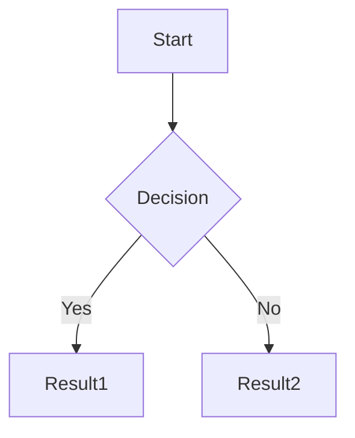

# Resound - Hugo Theme  
[](https://app.netlify.com/sites/hugo-theme-resound/deploys)

> **Make Your Content Resound**

> [!WARNING]  
> This theme is still under active development, please use with caution! Suggestions and feedback are welcome.

An elegant and feature-rich Hugo blog theme with support for slides, archives, search, and more.

[](https://gohugo.io/)
[](LICENSE)
[](https://hugo-theme-resound.netlify.app/)

## 📸 Live Demo

- **Live Demo**: [https://hugo-theme-resound.netlify.app/](https://hugo-theme-resound.netlify.app/)
- **Build Status**: [](https://app.netlify.com/projects/hugo-theme-resound/deploys)

## ✨ Features

- 📱 **Responsive Design** - Perfectly adapted for mobile, tablet, and desktop
- 🌓 **Dark Mode** - Auto-follows system, supports manual toggle
- 🎯 **Sidebar Navigation** - Drawer-style design with multi-level menus
- 📚 **Table of Contents (TOC)** - Auto-generated with scroll highlighting
- 📅 **Archives/Categories/Tags** - Grouped by year/month for easy browsing
- 🔍 **Site Search** - Front-end search with fast response
- 📡 **RSS Feed** - Full RSS 2.0 support
- 🎬 **Slide Support** - PPT mode based on Reveal.js
- 💬 **Comment System** - Supports Giscus with theme sync
- 📊 **Math Formulas** - MathJax support
- 📊 **Chart Support** - Mermaid support
- 🎨 **Code Highlighting** - Syntax highlighting with multiple themes
- 📊 **Google Analytics** - Analytics support
- ✨ **Custom Fonts** - Supports LXGW WenKai and other Chinese fonts
- 🎮 **404 Game Page** - Chrome dinosaur jump game

## 🚀 Quick Start

### Prerequisites

- Hugo >= 0.100.0 ([Installation Guide](https://gohugo.io/installation/))
- Git (optional)

### 1. Create a Hugo Site

```bash
hugo new site my-blog
cd my-blog
```

### 2. Install the Theme

**Method 1: Git Submodule (Recommended)**

```bash
git init
git submodule add https://github.com/ifeitao/hugo-theme-resound.git themes/resound
```

**Method 2: Direct Download**

Download and extract to the `themes/resound` directory.

### 3. Configure the Site

Copy the example configuration:

```bash
cp themes/resound/hugo.toml hugo.toml
```

Or manually create `hugo.toml`:

```toml
baseURL = 'https://yoursite.com'
languageCode = 'en-US'
defaultContentLanguage = 'en'
title = 'My Blog'
theme = 'resound'

# Pagination Configuration
[pagination]
  pagerSize = 10
  path = 'page'

[params]
  slogan = 'Record life, share knowledge'
  author = 'Your Name'
  logo = '/logo.png'
  recent_post = 10
  
  # Navigation Configuration
  [params.nav]
    name = 'Home'
    url = '/'
    [[params.nav.items]]
      name = 'Archives'
      url = '/archive/'
    [[params.nav.items]]
      name = 'Categories'
      url = '/categories/'
    [[params.nav.items]]
      name = 'Tags'
      url = '/tags/'
    [[params.nav.items]]
      name = 'Search'
      url = '/search/'
    [[params.nav.items]]
      name = 'About'
      url = '/about/'

# Taxonomy Configuration
[taxonomies]
  category = 'categories'
  tag = 'tags'

# Output Formats
[outputs]
  home = ['HTML', 'RSS', 'JSON']
  section = ['HTML', 'RSS']

# Markup Configuration
[markup]
  [markup.goldmark]
    [markup.goldmark.renderer]
      unsafe = true
  [markup.highlight]
    codeFences = true
    lineNos = false
    noClasses = false
    style = 'monokai'

# Permalinks
[permalinks]
  posts = '/:year/:month/:day/:title/'
```

### 4. Create Necessary Pages

```bash
# Create archive page
cat > content/archive.md << 'EOF'
---
title: "Archives"
layout: "archive"
url: "/archive/"
date: 2024-01-01
---
EOF

# Create search page
cat > content/search.md << 'EOF'
---
title: "Search"
layout: "search"
url: "/search/"
date: 2024-01-01
---
EOF
```

### 5. Create Your First Post

```bash
hugo new posts/my-first-post.md
```

Edit `content/posts/my-first-post.md`:

```yaml
---
title: "My First Post"
date: 2024-01-01T10:00:00+08:00
categories: ["Technology"]
tags: ["Hugo", "Blog"]
toc: true
draft: false
---
```

### 6. Local Preview

```bash
hugo server -D
```

Visit http://localhost:1313 to preview the site.

### 7. Build the Site

```bash
hugo --minify
```

The generated static files will be located in the `public` directory.

## 📝 Post Front Matter

```yaml
---
title: "Post Title"
date: 2024-01-01
categories: ["Category1", "Category2"]
tags: ["Tag1", "Tag2"]
toc: true           # Enable table of contents
mathjax: true       # Enable math formulas
mermaid: true       # Enable Mermaid charts
layout: "slide"     # Slide mode
theme: "black"      # Slide theme
transition: "slide" # Slide transition effect
---
```

## ⚙️ Configuration Guide

### RSS Feed

The theme has RSS enabled by default with the following configuration:

```toml
# Output formats
[outputs]
  home = ['HTML', 'RSS', 'JSON']
  section = ['HTML', 'RSS']

# RSS configuration
[services]
  [services.rss]
    limit = 20  # Number of items in RSS feed
```

**Access RSS:**
- Full site feed: `https://yoursite.com/index.xml`
- Category feed: `https://yoursite.com/categories/tech/index.xml`
- Tag feed: `https://yoursite.com/tags/hugo/index.xml`

RSS feed includes:
- Full article content (`<content:encoded>`)
- Article summary (`<description>`)
- Category and tag information
- Publication date and author information

An RSS subscription link is available in the sidebar menu for easy one-click subscription.

### Comment System (Giscus)

```toml
[params]
  comments_provider = 'giscus'
  [params.giscus]
    repo = 'username/repo'
    repo_id = 'your-repo-id'
    category = 'General'
    category_id = 'your-category-id'
    mapping = 'pathname'
    lang = 'en'
```

### Google Analytics

```toml
[params]
  analytics_provider = 'google'
  google_analytics = 'G-XXXXXXXXXX'

[privacy]
  [privacy.googleAnalytics]
    anonymizeIP = true
    respectDoNotTrack = true
```

### Friend Links

```toml
[params.friends]
  "Friend Name" = "https://friend-site.com"
  "Another Friend" = "https://another-friend.com"
```

## 🌟 Advanced Features

### Slide Mode

Create a slide post:

```yaml
---
title: "My Presentation"
layout: "slide"
theme: "black"        # Options: black, white, league, sky, beige, simple
transition: "slide"   # Options: none, fade, slide, convex, concave, zoom
titlepage: true
mathjax: true
---

# First Slide

Content...


Use fenced code blocks (auto-detected, no need to set `mermaid: true` in front matter):
Content...

...

# New Section

Content...
```

**Operation Instructions:**
- `..` - Vertical next slide
- `...` - Horizontal next slide
- ←→ Left/Right arrows: Switch main slides
- ↑↓ Up/Down arrows: Switch sub-slides within the same theme
- Esc key: View slide overview
- F key: Fullscreen mode

### Math Formulas

Enable MathJax:

```yaml
---
mathjax: true
---
```

Usage example:

```markdown
Inline formula: $E = mc^2$

Block formula:
$$
\int_{-\infty}^{\infty} e^{-x^2} dx = \sqrt{\pi}
$$
```

### Mermaid Charts

Use fenced code blocks:

```markdown

```

### Video Embeds

Use built-in shortcodes instead of writing raw `<iframe>` code.

**Bilibili:** Supports numeric `av` ID or `BV` ID.

```markdown


```

**YouTube:** Use the video ID (the value after `v=` in the watch URL).

```markdown

```

Features:
- Responsive 16:9 container with lazy loading
- Cleaner content: avoid verbose iframe markup & Raw HTML warnings
- Only supply the ID; theme handles player URL and attributes

You can override styling via `.video-embed` in custom CSS.

## 🛠️ Custom Configuration

### Theme Color Configuration

TODO

### Custom Font Configuration

TODO
Currently using LXGW WenKai font via CDN

### Post Expiration Warning

Supports post expiration warning feature:

```toml
[params]
  # Post expiration configuration
  expire_days = 365  # Defaults to 365 days
```

When the last modification time of a post exceeds the set number of days from the current time, an expiration warning will be displayed at the top of the post.

### Featured Posts

Supports featured posts feature:

1. Add `featured: true` field in the post's frontmatter to mark featured posts
2. Visit `/featured/` page to view all featured posts

### Related Posts Recommendation

Supports related posts recommendation on post detail pages. The system automatically finds related posts based on the post's categories, tags, etc., using Hugo's built-in .Related mechanism.

## 📝 License

MIT License

Copyright (c) 2024 ifeitao

## 🚀 Deployment (Netlify)

We recommend deploying the demo site (`exampleSite`) via Netlify. This repo includes `netlify.toml` for zero-config builds.

### Quick Deploy

1. Sign in to [Netlify](https://app.netlify.com)
2. Click “Import an existing project” and select GitHub repo `ifeitao/hugo-theme-resound`
3. Keep default build settings (uses `netlify.toml` in this repo)
4. Visit the domain provided after the first deploy

### Build settings

- Production builds use `$URL` as `baseURL`
- Preview builds use `$DEPLOY_PRIME_URL` as `baseURL`
- Publish directory: `exampleSite/public`

### Status badge

Add the Netlify status badge at the top of README (replace `YOUR-SITE-ID` and `YOUR-SITE-NAME`):

```
[](https://app.netlify.com/sites/YOUR-SITE-NAME/deploys)
```

> You can find the Site ID in Netlify → Site settings → Status badges.

## ❤️ Contribution

Issues and Pull Requests are welcome!

## 📋 TODO

### Planned Improvements

1. **🎨 Theme System Enhancement**
   - Support more preset color schemes (Tech Blue, Forest Green, Violet, etc.)
   - Provide visual theme configuration tool
   - Enhance color contrast in dark mode

2. **📱 Mobile Experience Optimization**
   - Optimize touch gesture interactions
   - Improve mobile TOC navigation
   - Add bottom navigation bar (quick access to main features)

3. **🔍 Search Functionality Enhancement**
   - Support search suggestions and auto-completion
   - Add highlighted preview in search results
   - Implement tag/category filtering

4. **📊 Content Display Optimization**
   - Add article series feature (serialized posts)
   - Support post pinning and recommendation weight
   - Implement timeline view
   - Add reading progress indicator

5. **🚀 Performance & Accessibility**
   - Implement image lazy loading and responsive images
   - Optimize first screen load speed
   - Improve keyboard navigation support
   - Enhance screen reader compatibility

Feel free to suggest more ideas in [Issues](https://github.com/ifeitao/hugo-theme-resound/issues)!

## 🔗 Links

- **Theme Repository**: https://github.com/ifeitao/hugo-theme-resound
- **Example Site**: https://hugo-theme-resound.netlify.app/
- **Hugo Official Documentation**: https://gohugo.io/documentation/

---

*Resound - Make Your Content Resound* 🎵