本文展示 Resound 主题中 Mermaid 图表的渲染效果。

<!--more-->

## 流程图

### 简单流程图

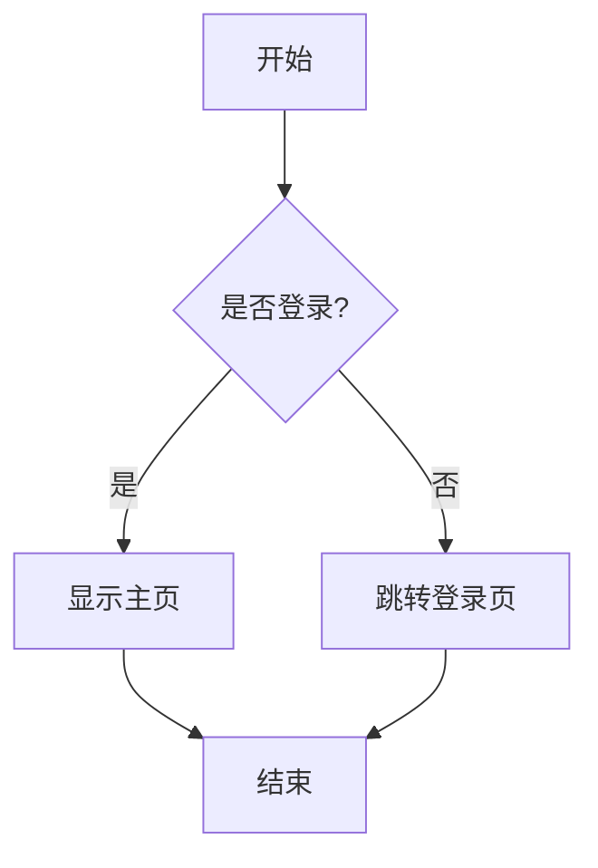

### 复杂流程图

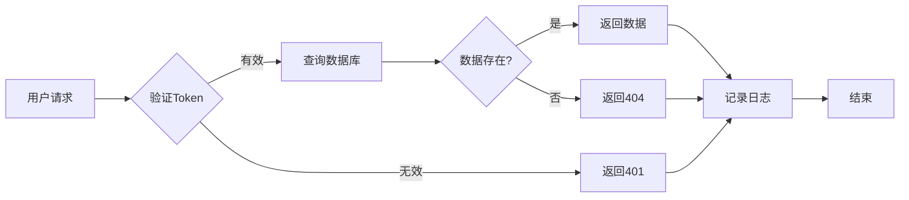

## 时序图

### API调用时序图

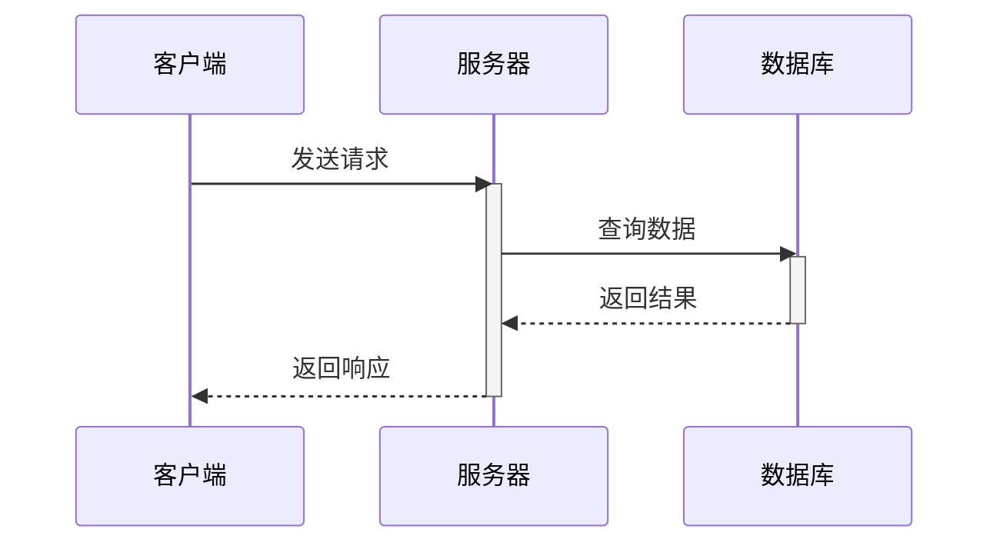

### 用户认证流程

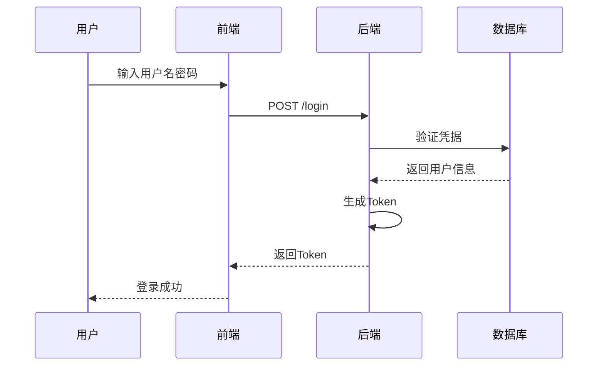

## 类图

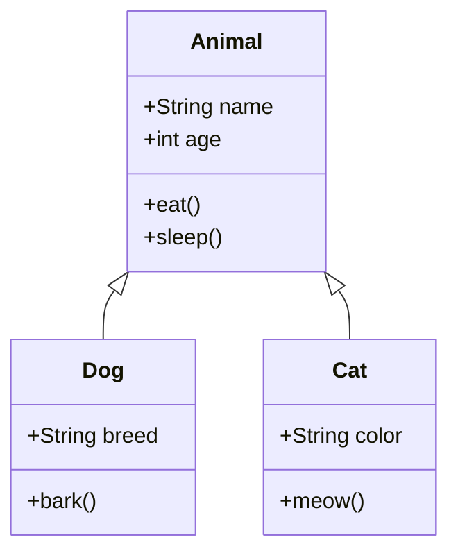

## 状态图

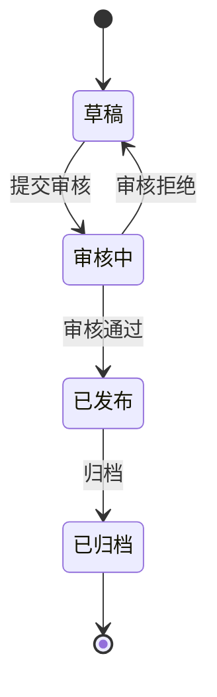

## 甘特图

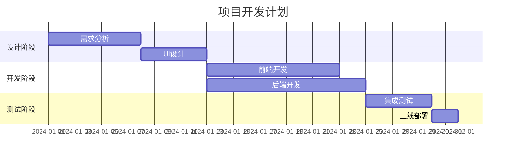

## 饼图

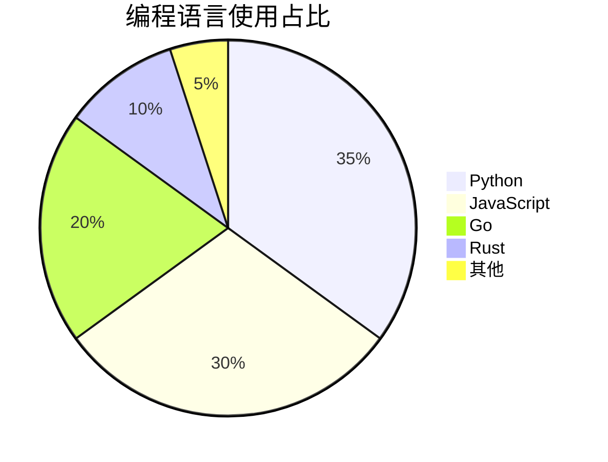

## Git图

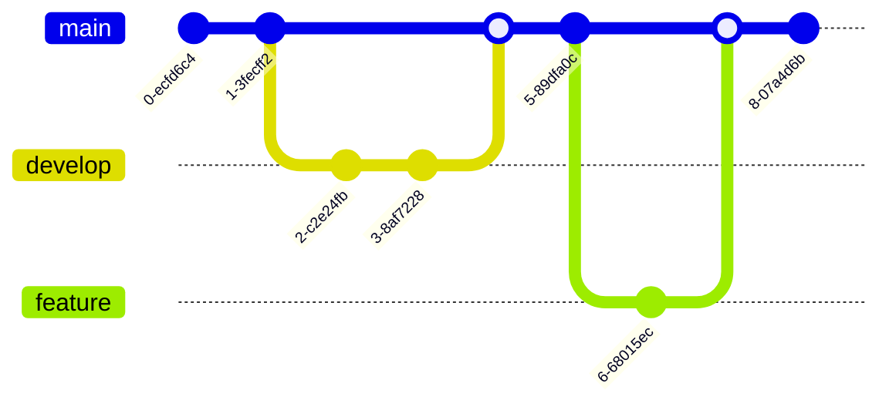

## ER图（实体关系图）

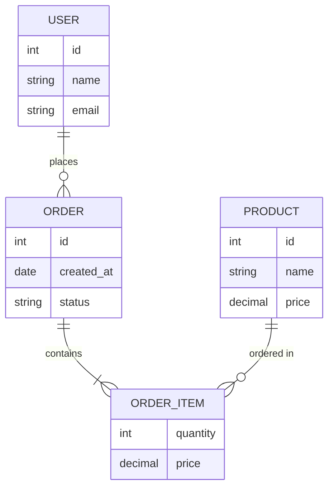

## 旅程图

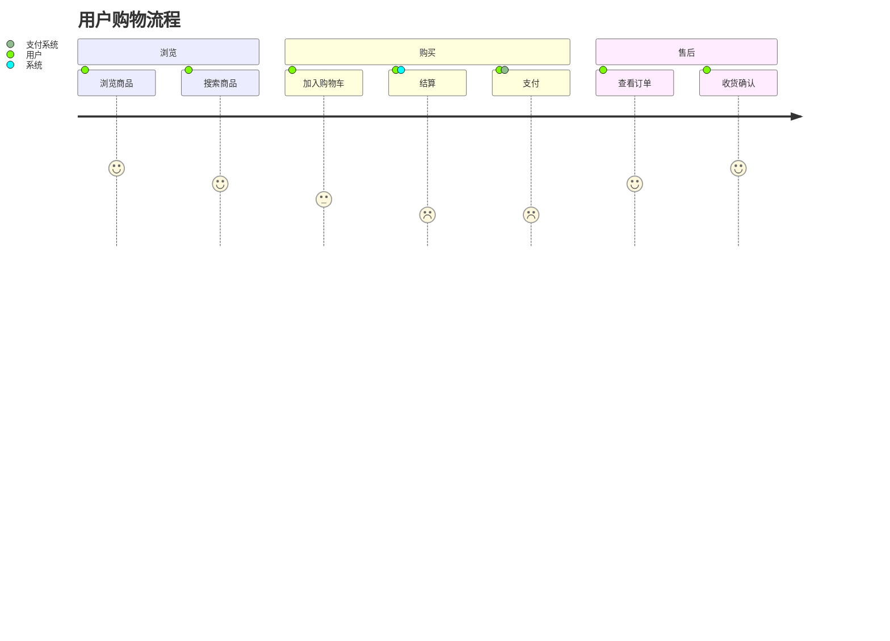

## 使用方法

在文章的 front matter 中启用 Mermaid：

```yaml
---
mermaid: true
---
```

然后使用代码块语法：

````markdown
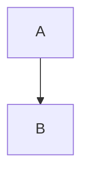
````

## 更多资源

- [Mermaid 官方文档](https://mermaid.js.org/)
- [在线编辑器](https://mermaid.live/)
- [语法参考](https://mermaid.js.org/intro/syntax-reference.html)

---

**用 Mermaid 让图表变得简单！** 📊
